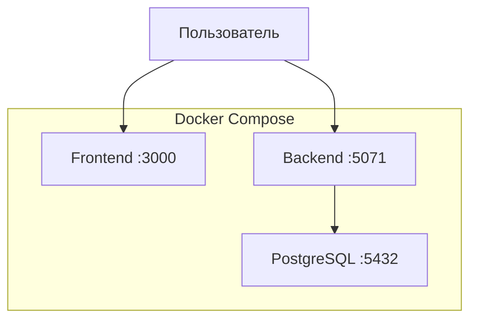

# Архитектура проекта

## Технологический стек

| Слой | Технологии |
|--------|------------|
| Frontend | React 19, Vite 8, TypeScript 6, Tailwind CSS 3.4, React Router 7, Axios |
| Backend | ASP.NET Core 8, EF Core 7 (Npgsql), BCrypt.Net-Next |
| База данных | PostgreSQL 15 |
| Инфраструктура | Docker Compose, GitHub Actions |
| API-документация | Swagger / OpenAPI |

---

## Схема взаимодействия



### Авторизация

- JWT Bearer
- Срок жизни токена: 7 дней
- Токен содержит:
  - идентификатор пользователя;
  - логин;
  - роль.
- Ролевая авторизация реализована через атрибуты `[Authorize(Roles = "...")]`.

---

## Структура проекта

```text
.
├── .github/
│   └── workflows/
│       └── ci.yml
├── src/
│   ├── backend/api/
│   │   ├── Controllers/
│   │   ├── Data/
│   │   ├── Migrations/
│   │   ├── Models/
│   │   │   ├── Entities/
│   │   │   └── DTOs/
│   │   ├── Dockerfile
│   │   ├── Program.cs
│   │   └── appsettings.json
│   └── frontend/
│       ├── src/
│       │   ├── components/
│       │   ├── context/
│       │   ├── hooks/
│       │   ├── layouts/
│       │   ├── pages/
│       │   ├── services/
│       │   ├── types/
│       │   └── utils/
│       ├── Dockerfile
│       └── nginx.conf
├── tests/
│   └── TrainingCenter.Tests/
├── scripts/
│   └── seed.sql
├── docs/
├── docker-compose.yml
├── .env.example
└── README.md
```

---

## База данных

### Таблицы

| Таблица | Назначение |
|----------|------------|
| `Users` | Пользователи |
| `Applications` | Заявки на обучение |
| `Directions` | Направления подготовки |
| `TrainingFormats` | Форматы обучения |
| `Comments` | Комментарии к заявкам |
| `StatusHistories` | История изменения статусов |
| `AuditLogs` | Журнал аудита действий |

### Особенности

- Все первичные ключи имеют тип `Guid` (`UUID` в PostgreSQL).
- Связи между сущностями описаны через Data Annotations.
- Доступ к данным реализован через EF Core.

---

## API

### Auth

Базовый маршрут: `/api/auth`

| Метод | Маршрут | Описание |
|---------|----------|----------|
| POST | `/register` | Регистрация пользователя |
| POST | `/login` | Аутентификация и получение JWT |

---

### Users

Базовый маршрут: `/api/users`

Доступ: `Manager`, `Admin`, `Director`

| Метод | Маршрут | Описание |
|---------|----------|----------|
| GET | `/?role=` | Получение списка пользователей |

---

### Applications

Базовый маршрут: `/api/applications`

| Метод | Маршрут | Доступ |
|---------|----------|---------|
| GET | `/?my=&status=&directionId=&formatId=` | Все роли |
| POST | `/` | Все роли |
| PATCH | `/{id}/assign` | Manager |
| PATCH | `/{id}/status` | Manager |
| POST | `/{id}/comments` | Все роли |
| GET | `/{id}/comments` | Все роли |

---

### Dictionaries

Базовый маршрут: `/api/dictionaries`

| Метод | Маршрут |
|---------|----------|
| GET, POST, PUT, DELETE | `/directions` |
| GET, POST, PUT, DELETE | `/training-formats` |
| GET | `/statuses` |

Доступ:
- чтение — все роли;
- изменение справочников — `Admin`.

---

### Analytics

Базовый маршрут: `/api/analytics`

Доступ: `Director`, `Admin`

| Метод | Маршрут |
|---------|----------|
| GET | `/statistics` |

---

## Роли

| Роль | Возможности |
|--------|-------------|
| Applicant | Создание, просмотр и комментирование собственных заявок |
| Manager | Просмотр всех заявок, назначение ответственных, изменение статусов, комментирование |
| Admin | Управление справочниками, просмотр пользователей и статистики |
| Director | Просмотр пользователей и аналитики |

---

## Статусы заявок

| Код | Отображение |
|------|-------------|
| `New` | Новая |
| `InProgress` | В работе |
| `NeedsInfo` | Требуется уточнение |
| `Approved` | Согласована |
| `Rejected` | Отклонена |
| `Completed` | Завершена |

---

## Ключевые компоненты

### Backend

- ASP.NET Core Web API
- EF Core + PostgreSQL
- JWT-аутентификация
- Swagger
- Автоматическое применение миграций при запуске

### Frontend

- React SPA
- React Router
- Context API для авторизации
- Axios с JWT-интерсептором
- Хранение токена в `localStorage`

### Инфраструктура

- Docker Compose:
  - PostgreSQL
  - Backend
  - Frontend
- Multi-stage Docker-сборка
- GitHub Actions для CI

### Тестирование

- xUnit
- FluentAssertions
- Moq
- WebApplicationFactory для интеграционных тестов
- InMemory Provider для unit-тестов