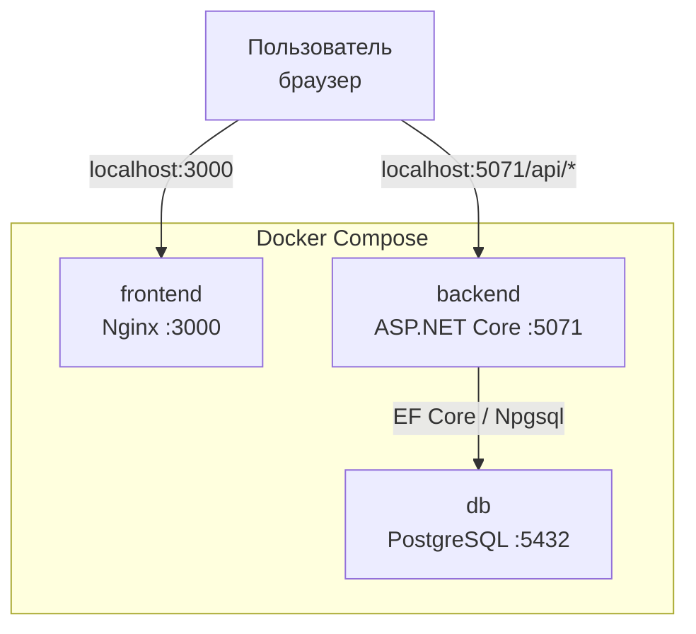
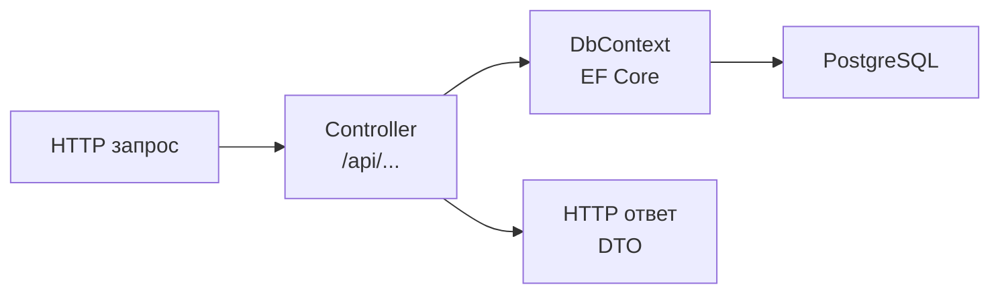

# Архитектура проекта

## Стек

| Слой | Технология |
|---|---|
| Frontend | React 19 + Vite, TypeScript, Tailwind CSS 3, Nginx |
| Backend | ASP.NET Core 8, EF Core 8, BCrypt.Net |
| База данных | PostgreSQL 15 |
| Инфраструктура | Docker Compose, GitHub Actions CI |
| Документация API | Swagger / OpenAPI |

---

## Как всё работает вместе



Пользователь открывает `localhost:3000`, после чего Nginx отдаёт SPA. API-запросы фронтенд отправляет напрямую на бэкенд `localhost:5071/api`. Бэкенд работает с БД через EF Core.

---

## Архитектура бэкенда



**Controller** - принимает запросы, валидирует данные, работает с DbContext, возвращает DTO.

**DbContext** - маппинг моделей на таблицы, миграции, запросы через LINQ.

**DTO** - отдельные классы для входящих запросов и исходящих ответов. Entity наружу не отдаются.

### Контроллеры

| Контроллер | Маршрут | Доступ |
|---|---|---|
| `AuthController` | `/api/auth` | Публичный |
| `ApplicationsController` | `/api/applications` | Все роли |
| `DictionariesController` | `/api/dictionaries` | GET - все, POST/PUT/DELETE - Admin |
| `UsersController` | `/api/users` | Manager, Admin, Director |
| `AnalyticsController` | `/api/analytics` | Director |

### Авторизация

JWT-токен передаётся в заголовке каждого запроса:
```
Authorization: Bearer <token>
```

Токен содержит Id пользователя, логин и роль. Доступ ограничивается через `[Authorize(Roles = "Admin")]`.

---

## Структура проекта

```
├── .github/workflows/
│   └── ci.yml
├── src/
│   ├── backend/
│   │   └── api/
│   │       ├── Controllers/
│   │       ├── Data/
│   │       ├── Migrations/
│   │       ├── Models/
│   │       │   ├── Entities/
│   │       │   ├── DTOs/
│   │       │   └── Enums/
│   │       ├── Dockerfile
│   │       └── Program.cs
│   └── frontend/
│       ├── src/
│       │   ├── components/
│       │   ├── context/
│       │   ├── hooks/
│       │   ├── layouts/
│       │   ├── pages/
│       │   ├── services/
│       │   ├── types/
│       │   └── utils/
│       ├── Dockerfile
│       └── nginx.conf
├── tests/
│   └── TrainingCenter.Tests/
├── scripts/
│   └── seed.sql
├── docs/
├── docker-compose.yml
├── .env.example
└── README.md
```

---

## Запуск проекта

### Локальная разработка

```bash
# БД
docker compose up db -d

# Бэкенд
cd src/backend/api
dotnet run

# Фронтенд
cd src/frontend
npm install
npm run dev
```

### Через Docker

```bash
cp .env.example .env
docker compose up -d --build
```

После запуска:
- `localhost:3000` — приложение
- `localhost:5071/swagger` — документация API

---

## Переменные окружения

Хранятся в `.env` (не в git). Шаблон — `.env.example`:

```env
POSTGRES_USER=
POSTGRES_PASSWORD=
POSTGRES_DB=

JWT_SECRET=
JWT_ISSUER=AppealsBackend
JWT_AUDIENCE=AppealsFrontend
```

Фронтенд подключается к бэкенду через `VITE_API_URL` (по умолчанию `http://localhost:5071/api`).

---

## Docker-сборка

Оба Dockerfile используют multi-stage сборку.

**Backend** — SDK образ для сборки, ASP.NET Runtime для запуска.

**Frontend** — Node для сборки Vite, Nginx Alpine для раздачи статики.

Nginx настроен с SPA fallback, gzip и долгосрочным кэшированием ассетов.

---

## Роли пользователей

| Роль | Что может |
|---|---|
| `Applicant` | Создавать заявки, смотреть свои |
| `Manager` | Обрабатывать заявки, менять статусы, комментировать |
| `Admin` | Управлять справочниками и пользователями |
| `Director` | Просматривать статистику и отчёты |