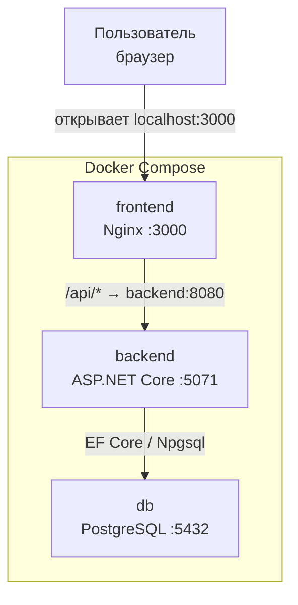
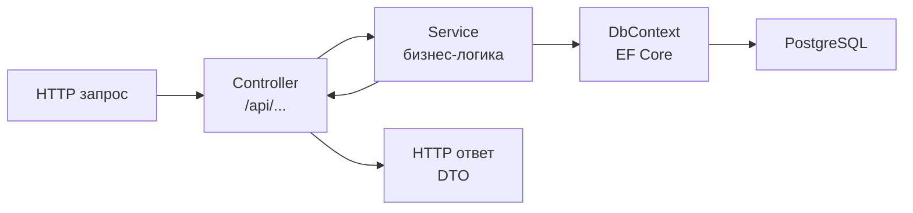

# Архитектура проекта

## Стек

| Слой | Технология |
|---|---|
| Frontend | React + Vite, Nginx |
| Backend | ASP.NET Core 8, EF Core 8 |
| База данных | PostgreSQL 16 |
| Инфраструктура | Docker Compose |

---

## Как всё работает вместе



Пользователь открывает браузер на `localhost:3000`. Все запросы к API фронтенд отправляет через Nginx, который проксирует их на бэкенд. Бэкенд работает с базой данных через EF Core.

---

## Архитектура бэкенда



### Слои

**Controller** - принимает HTTP запросы, валидирует входные данные, возвращает ответ. Не содержит бизнес-логики.

**Service** - вся бизнес-логика здесь. Работает с DbContext, проверяет правила (например, нельзя удалить направление если оно используется в заявках).

**DbContext (EF Core)** - маппинг моделей на таблицы БД, миграции, запросы через LINQ.

**DTO** — отдельные классы для входящих запросов (`RequestDto`) и исходящих ответов (`ResponseDto`). Модели Entity наружу не отдаются.

### Контроллеры

| Контроллер | Маршрут | Доступ |
|---|---|---|
| `AuthController` | `/api/auth` | Публичный |
| `ApplicationsController` | `/api/applications` | Все роли |
| `DictionariesController` | `/api/dictionaries` | GET — все, POST/PUT/DELETE — Admin |
| `UsersController` | `/api/users` | Manager, Admin, Director |

### Авторизация

Используется JWT. После входа фронтенд получает токен и отправляет его в заголовке каждого запроса:
```
Authorization: Bearer <token>
```

Токен содержит Id пользователя, логин и роль. Бэкенд проверяет роль через `[Authorize(Roles = "Admin")]`.

---

## Структура проекта

```
ТЗ/
├── src/
│   ├── backend/
│   │   └── api/
│   │       ├── Controllers/     # HTTP эндпоинты
│   │       ├── Services/        # бизнес-логика
│   │       ├── Models/
│   │       │   ├── Entities/    # модели БД
│   │       │   └── DTOs/        # модели запросов и ответов
│   │       ├── Data/
│   │       │   └── ApplicationDbContext.cs
│   │       └── Program.cs
│   └── frontend/
│       └── src/
│           ├── components/
│           ├── pages/
│           └── api/             # запросы к бэкенду
├── docs/                        # документация
├── docker-compose.yml
└── .env.example
```

---

## Запуск проекта

### Локальная разработка (без Docker)

Каждый запускает свою часть отдельно:

```bash
# Бэкенд
cd src/backend/api
dotnet run

# Фронтенд
cd src/frontend
npm install
npm run dev
```

БД при этом -  локальный PostgreSQL или Docker только для БД:
```bash
docker compose up db -d
```

### Полный запуск через Docker

```bash
cp .env.example .env      # заполнить переменные
docker compose up -d --build
```

После запуска доступно:
- `localhost:3000` — приложение
- `localhost:5071/swagger` — документация API

---

## Переменные окружения

Все секреты хранятся в `.env` файле (не в git). Шаблоном является `.env.example`:

```env
POSTGRES_DB=learning_center
POSTGRES_USER=postgres
POSTGRES_PASSWORD=           # заполнить локально
JwtSettings__Secret=         # минимум 32 символа
JwtSettings__Issuer=AppealsBackend
JwtSettings__Audience=AppealsFrontend
```
---

## Роли пользователей

| Роль | Что может |
|---|---|
| `Applicant` | Создавать заявки, смотреть свои |
| `Manager` | Обрабатывать заявки, менять статусы, комментировать |
| `Admin` | Управлять справочниками и пользователями |
| `Director` | Просматривать статистику и отчёты |