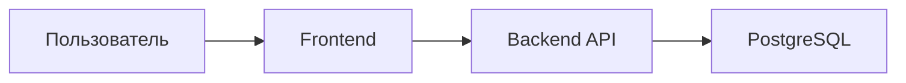

# Архитектура проекта

## Общая схема

Система состоит из трёх основных частей:

* клиентское приложение
* серверное приложение
* база данных

Пользователь работает через веб-интерфейс. Клиент отправляет запросы на сервер через REST API. Сервер обрабатывает данные и взаимодействует с PostgreSQL.



## Технологии

Клиентская часть разработана на React с использованием TypeScript и Tailwind CSS.

Серверная часть построена на ASP.NET Core и Entity Framework Core.

В качестве базы данных используется PostgreSQL.

Для контейнеризации применяется Docker Compose, а для автоматической сборки и проверки проекта — GitHub Actions.

Документация API доступна через Swagger.

## Авторизация

Для авторизации используется JWT.

После входа пользователь получает токен сроком действия 7 дней. В токене хранятся идентификатор пользователя, логин и роль.

Доступ к функциям системы определяется ролью пользователя.

Поддерживаются следующие роли:

* Applicant
* Manager
* Admin
* Director

## Структура проекта

Проект разделён на несколько основных каталогов:

```text
src/
├── backend/
├── frontend/

tests/
├── TrainingCenter.Tests/

docs/
scripts/
.github/
```

### Backend

Серверная часть содержит:

* контроллеры API
* модели и DTO
* работу с базой данных
* middleware-компоненты
* миграции базы данных
* конфигурацию приложения

### Frontend

Клиентская часть содержит:

* страницы приложения
* переиспользуемые компоненты
* сервисы для работы с API
* контекст авторизации
* пользовательские хуки
* вспомогательные типы и утилиты

## База данных

Система использует семь основных таблиц:

| Таблица         | Назначение                 |
| --------------- | -------------------------- |
| Users           | Пользователи               |
| Applications    | Заявки                     |
| Directions      | Направления обучения       |
| TrainingFormats | Форматы обучения           |
| Comments        | Комментарии                |
| StatusHistories | История изменения статусов |
| AuditLogs       | Журнал действий            |

Для всех записей используются идентификаторы формата UUID.

Доступ к данным реализован через Entity Framework Core.

## API

Все функции системы доступны через REST API.

Основные разделы API:

| Раздел              | Назначение              |
| ------------------- | ----------------------- |
| `/api/auth`         | Регистрация и вход      |
| `/api/users`        | Работа с пользователями |
| `/api/applications` | Работа с заявками       |
| `/api/dictionaries` | Справочники             |
| `/api/analytics`    | Статистика и аналитика  |

## Роли пользователей

### Applicant

Может создавать заявки, просматривать свои заявки и оставлять комментарии.

### Manager

Может просматривать все заявки, назначать ответственных сотрудников, изменять статусы и работать с комментариями.

### Admin

Может управлять справочниками, просматривать пользователей и статистику.

### Director

Может просматривать пользователей и аналитические данные.

## Статусы заявок

В системе используются следующие статусы:

| Статус     | Описание            |
| ---------- | ------------------- |
| New        | Новая заявка        |
| InProgress | В работе            |
| NeedsInfo  | Требуется уточнение |
| Approved   | Согласована         |
| Rejected   | Отклонена           |
| Completed  | Завершена           |

Все изменения статусов сохраняются в истории.

## Основные компоненты

### Серверная часть

Сервер отвечает за:

* обработку запросов
* авторизацию пользователей
* проверку прав доступа
* работу с базой данных
* ведение журналов
* обработку ошибок

Также при запуске автоматически применяются миграции базы данных.

### Клиентская часть

Клиентское приложение отвечает за:

* отображение интерфейса
* навигацию между страницами
* хранение данных авторизации
* взаимодействие с API

JWT-токен сохраняется в localStorage и автоматически добавляется ко всем защищённым запросам.

### Инфраструктура

Проект запускается через Docker Compose и включает:

* PostgreSQL
* Backend API
* Frontend

Для сборки контейнеров используются многоэтапные Docker-образы.

Проверка проекта выполняется автоматически через GitHub Actions.

## Тестирование

Для тестирования используются:

* xUnit
* FluentAssertions
* Moq

Тестами покрыты основные сценарии работы серверной части, включая авторизацию, заявки, справочники, пользователей и аналитику.

## Связанные документы

- [specification.md](specification.md) — техническое задание
- [database.md](database.md) — схема базы данных
- [docker-guide.md](docker-guide.md) — запуск через Docker
- [test-data.md](test-data.md) — тестовые данные
- [implemented-features.md](implemented-features.md) — список функций
- [known-limitations.md](known-limitations.md) — ограничения