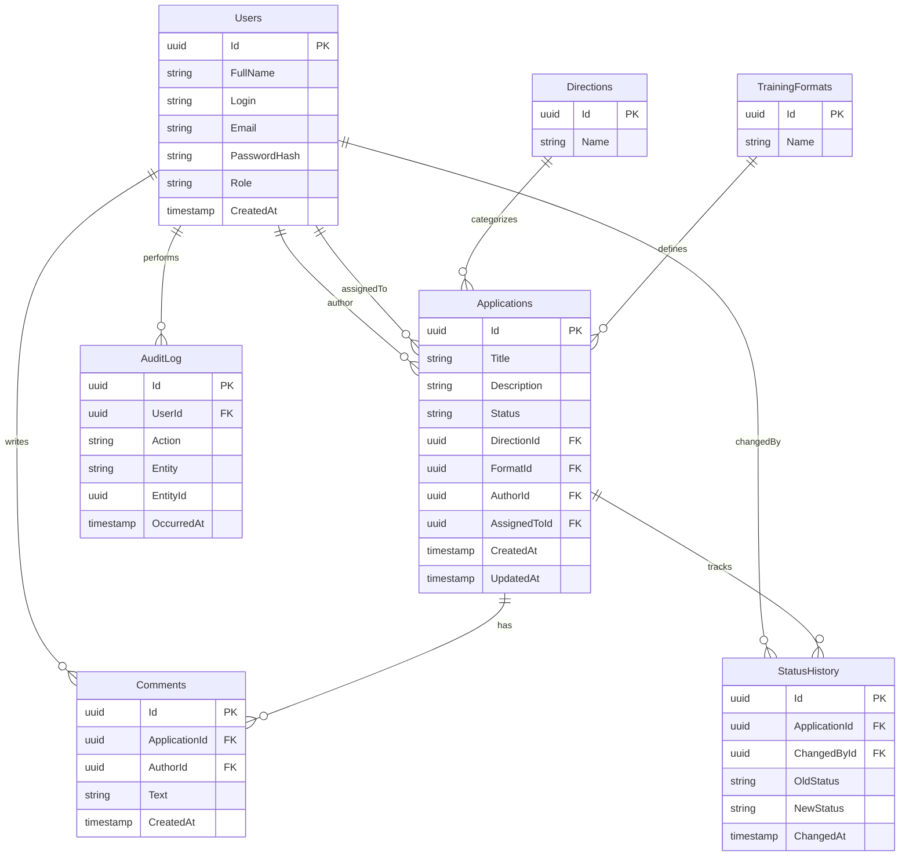

# Схема базы данных

## Стек

* PostgreSQL 15
* Entity Framework Core
* Code First миграции

Подробное описание системы находится в [architecture.md](architecture.md).

## Диаграмма

## Таблицы

| Таблица         | Назначение                    |
| --------------- | ----------------------------- |
| Users           | Пользователи системы          |
| Applications    | Заявки на обучение            |
| Directions      | Направления обучения          |
| TrainingFormats | Форматы обучения              |
| Comments        | Комментарии к заявкам         |
| StatusHistory   | История изменения статусов    |
| AuditLog        | Журнал действий пользователей |

## Users

| Поле         | Описание                   |
| ------------ | -------------------------- |
| Id           | Идентификатор пользователя |
| FullName     | ФИО                        |
| Login        | Логин                      |
| Email        | Email                      |
| PasswordHash | Хэш пароля                 |
| Role         | Роль пользователя          |
| CreatedAt    | Дата создания              |

## Applications

| Поле         | Описание                |
| ------------ | ----------------------- |
| Id           | Идентификатор заявки    |
| Title        | Название заявки         |
| Description  | Описание                |
| Status       | Текущий статус          |
| DirectionId  | Направление обучения    |
| FormatId     | Формат обучения         |
| AuthorId     | Автор заявки            |
| AssignedToId | Ответственный сотрудник |
| CreatedAt    | Дата создания           |
| UpdatedAt    | Дата изменения          |

## Directions

| Поле | Описание             |
| ---- | -------------------- |
| Id   | Идентификатор        |
| Name | Название направления |

## TrainingFormats

| Поле | Описание         |
| ---- | ---------------- |
| Id   | Идентификатор    |
| Name | Название формата |

## Comments

| Поле          | Описание                  |
| ------------- | ------------------------- |
| Id            | Идентификатор комментария |
| ApplicationId | Заявка                    |
| AuthorId      | Автор комментария         |
| Text          | Текст комментария         |
| CreatedAt     | Дата создания             |

## StatusHistory

| Поле          | Описание                        |
| ------------- | ------------------------------- |
| Id            | Идентификатор записи            |
| ApplicationId | Заявка                          |
| ChangedById   | Пользователь, изменивший статус |
| OldStatus     | Предыдущий статус               |
| NewStatus     | Новый статус                    |
| ChangedAt     | Дата изменения                  |

## AuditLog

| Поле       | Описание               |
| ---------- | ---------------------- |
| Id         | Идентификатор записи   |
| UserId     | Пользователь           |
| Action     | Выполненное действие   |
| Entity     | Тип сущности           |
| EntityId   | Идентификатор сущности |
| OccurredAt | Дата и время действия  |

## Особенности

* Все первичные ключи используют UUID.
* Для пользователей действуют уникальные ограничения на логин и email.
* История статусов хранится отдельно от основной записи заявки.
* Действия пользователей сохраняются в журнал аудита.
