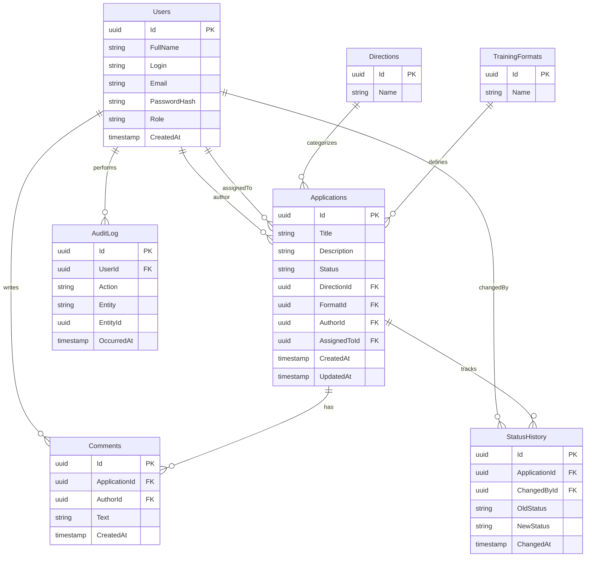

# Схема базы данных

## Стек
- PostgreSQL 15
- EF Core (Code First, миграции)

---

## Диаграмма

---

## Описание таблиц

### Users — Пользователи

| Поле | Тип | Описание |
|---|---|---|
| Id | uuid | Первичный ключ |
| FullName | string | Полное имя |
| Login | string | Логин для входа, уникальный |
| Email | string | Электронная почта, уникальная |
| PasswordHash | string | Хэш пароля |
| Role | string | Роль пользователя (см. ниже) |
| CreatedAt | timestamp | Дата регистрации |

**Роли пользователей:**

| Значение | Описание |
|---|---|
| `Applicant` | Заявитель — создаёт заявки и отслеживает статус |
| `Manager` | Менеджер — обрабатывает заявки, меняет статусы |
| `Admin` | Администратор — управляет справочниками и пользователями |
| `Director` | Руководитель — просматривает статистику и отчёты |

---

### Applications — Заявки

| Поле | Тип | Описание |
|---|---|---|
| Id | uuid | Первичный ключ |
| Title | string | Тема заявки |
| Description | string | Описание потребности |
| Status | string | Текущий статус (см. ниже) |
| DirectionId | uuid FK | Направление обучения |
| FormatId | uuid FK | Формат обучения |
| AuthorId | uuid FK | Автор заявки |
| AssignedToId | uuid FK | Ответственный менеджер |
| CreatedAt | timestamp | Дата создания |
| UpdatedAt | timestamp | Дата последнего изменения |

**Статусы заявки:**

| Значение | Описание |
|---|---|
| `New` | Новая — только создана |
| `InProgress` | В работе — взята менеджером |
| `NeedsInfo` | Требуется уточнение |
| `Approved` | Согласована |
| `Rejected` | Отклонена |
| `Completed` | Завершена |

---

### Directions — Направления обучения

| Поле | Тип | Описание |
|---|---|---|
| Id | uuid | Первичный ключ |
| Name | string | Название направления |

---

### TrainingFormats — Форматы обучения

| Поле | Тип | Описание |
|---|---|---|
| Id | uuid | Первичный ключ |
| Name | string | Название формата |

---

### Comments — Комментарии

| Поле | Тип | Описание |
|---|---|---|
| Id | uuid | Первичный ключ |
| ApplicationId | uuid FK | Заявка |
| AuthorId | uuid FK | Автор комментария |
| Text | string | Текст комментария |
| CreatedAt | timestamp | Дата создания |

---

### StatusHistory — История статусов

| Поле | Тип | Описание |
|---|---|---|
| Id | uuid | Первичный ключ |
| ApplicationId | uuid FK | Заявка |
| ChangedById | uuid FK | Кто изменил статус |
| OldStatus | string | Предыдущий статус |
| NewStatus | string | Новый статус |
| ChangedAt | timestamp | Дата изменения |

---

### AuditLog — Журнал действий

| Поле | Тип | Описание |
|---|---|---|
| Id | uuid | Первичный ключ |
| UserId | uuid FK | Кто выполнил действие |
| Action | string | Тип действия (Create, Update, Delete) |
| Entity | string | Название сущности |
| EntityId | uuid | Id изменённой записи |
| OccurredAt | timestamp | Дата и время действия |
